# AI Copilot для микробизнеса

Интеллектуальный ассистент для микробизнеса, который объединяет гибридный RAG (Retrieval-Augmented Generation), долговременную память пользователей и цепочку LLM‑агентов для предоставления точных ответов по юридическим, маркетинговым и финансовым вопросам.

Система построена на микросервисной архитектуре и включает в себя:

- **Гибридный RAG** — комбинация dense-векторов (ruBERT) и sparse-векторов (BM25) через Reciprocal Rank Fusion для максимально точного поиска релевантной информации в базе знаний
- **Долговременная память** — автоматическое извлечение и сохранение фактов из диалогов, что позволяет системе запоминать контекст каждого пользователя и предоставлять персонализированные ответы
- **Многоагентная обработка** — цепочка специализированных агентов (Intent Rewrite → Retrieval → Answer → Validation) для обработки запросов с высокой точностью
- **Автоматический парсинг документов** — система регулярно парсит документы с государственных сайтов (ЦБ РФ, pravo.gov.ru, alfabank.ru, nalog.gov.ru) через Apache Airflow, обрабатывает PDF с OCR, создает фрагменты и индексирует их в векторную базу данных Qdrant
- **Обработка мультимедиа** — анализ изображений через vision-модели OpenRouter и парсинг документов (PDF, DOCX, DOC, TXT) с автоматическим извлечением текста
- **Real-time коммуникация** — мгновенная доставка ответов через WebSocket, автоматическая генерация названий чатов через LLM
- **Масштабируемая архитектура** — асинхронная обработка через Kafka, кэширование через Redis, горизонтальное масштабирование stateless сервисов


## Архитектура системы

```mermaid
graph TB
    subgraph "Client Layer"
        Frontend[Frontend<br/>React + TypeScript<br/>:3000]
    end

    subgraph "API Gateway Layer"
        Gateway[Gateway<br/>FastAPI<br/>:8000]
    end

    subgraph "Authentication"
        Auth[Auth Service<br/>FastAPI<br/>:8004]
    end

    subgraph "Message Processing"
        MessageSvc[Message Service<br/>FastAPI<br/>:8001]
        WSSvc[WebSocket Service<br/>FastAPI WebSocket<br/>:8002]
    end

    subgraph "AI Services"
        BotSvc[Bot Service<br/>FastAPI + Kafka Consumer<br/>:8003]
        AnalyzeImg[Analyze Image Service<br/>FastAPI<br/>:8005]
        DocParser[Document Parser Service<br/>FastAPI<br/>:8006]
        Summarizer[Summarizer Service<br/>Kafka Consumer]
        STT[STT Service<br/>Speech-to-Text<br/>:8010]
    end

    subgraph "Business Services"
        BusinessSvc[Business Service<br/>FastAPI<br/>:8007]
        CalendarSvc[Calendar Service<br/>FastAPI<br/>:8008]
        WBPnL[WB PnL Service<br/>FastAPI<br/>:8009]
    end

    subgraph "Data Processing"
        WebScraping[Web Scraping Service<br/>Apache Airflow<br/>:8080]
        QdrantInit[Qdrant Init Service<br/>One-time Script]
    end

    subgraph "Message Queue"
        Kafka[Apache Kafka<br/>:9092]
        Zookeeper[Zookeeper<br/>:2181]
    end

    subgraph "Data Storage"
        MongoDB[(MongoDB<br/>:27017)]
        Redis[(Redis<br/>:6379)]
        Qdrant[(Qdrant<br/>Vector DB<br/>:6333)]
        PostgreSQL[(PostgreSQL<br/>Airflow DB)]
        MinIO[(MinIO<br/>S3 Storage<br/>:9000)]
    end

    subgraph "External Services"
        OpenRouter[OpenRouter API<br/>LLM Provider]
        WBAPI[Wildberries API<br/>External]
    end

    %% Frontend connections
    Frontend -->|HTTP/REST| Gateway
    Frontend -->|WebSocket| WSSvc

    %% Gateway connections
    Gateway -->|Auth| Auth
    Gateway -->|Chats/Messages| MessageSvc
    Gateway -->|Image Analysis| AnalyzeImg
    Gateway -->|Document Parse| DocParser
    Gateway -->|Business Management| BusinessSvc
    Gateway -->|Calendar Events| CalendarSvc
    Gateway -->|WB Analytics| WBPnL
    Gateway -->|Onboarding| BotSvc
    Gateway -->|Kafka| Kafka

    %% Auth connections
    Auth --> MongoDB

    %% Message Service connections
    MessageSvc --> MongoDB
    MessageSvc --> Redis
    MessageSvc -->|Produce| Kafka

    %% WebSocket Service connections
    WSSvc -->|Consume| Kafka
    WSSvc -->|Delete Chat| MessageSvc

    %% Bot Service connections
    BotSvc -->|Consume| Kafka
    BotSvc -->|Produce| Kafka
    BotSvc --> MongoDB
    BotSvc --> Qdrant
    BotSvc --> OpenRouter

    %% Image Analysis connections
    AnalyzeImg --> OpenRouter
    AnalyzeImg --> MinIO

    %% Business Service connections
    BusinessSvc --> MongoDB

    %% Calendar Service connections
    CalendarSvc --> MongoDB

    %% WB PnL Service connections
    WBPnL --> MongoDB
    WBPnL --> Redis
    WBPnL --> WBAPI

    %% Summarizer connections
    Summarizer -->|Consume| Kafka
    Summarizer -->|Produce| Kafka
    Summarizer --> MongoDB
    Summarizer --> OpenRouter

    %% Web Scraping connections
    WebScraping --> Qdrant
    WebScraping --> PostgreSQL
    WebScraping --> OpenRouter
    WebScraping --> BotSvc
    WebScraping -->|Produce| Kafka

    %% Qdrant Init
    QdrantInit --> Qdrant

    %% Kafka topics
    Kafka -.->|chat-messages| BotSvc
    BotSvc -.->|bot-responses| Kafka
    Kafka -.->|bot-responses| WSSvc
    Gateway -.->|chat_title_request| Kafka
    Kafka -.->|chat_title_request| Summarizer
    Summarizer -.->|chat_title_generated| Kafka
    Kafka -.->|chat_title_generated| WSSvc

    %% Zookeeper
    Zookeeper --> Kafka

    style Frontend fill:#61dafb
    style Gateway fill:#009485
    style Auth fill:#009485
    style MessageSvc fill:#009485
    style WSSvc fill:#009485
    style BotSvc fill:#ff6b6b
    style AnalyzeImg fill:#009485
    style DocParser fill:#009485
    style Summarizer fill:#4ecdc4
    style STT fill:#009485
    style BusinessSvc fill:#009485
    style CalendarSvc fill:#009485
    style WBPnL fill:#009485
    style WebScraping fill:#ffa726
    style QdrantInit fill:#4ecdc4
    style Kafka fill:#231f20,color:#fff
    style MongoDB fill:#47a248,color:#fff
    style Redis fill:#dc382d,color:#fff
    style Qdrant fill:#00bcd4
    style PostgreSQL fill:#336791,color:#fff
    style MinIO fill:#ff9900
    style OpenRouter fill:#6366f1
    style WBAPI fill:#6366f1
```



Система построена на микросервисной архитектуре с использованием FastAPI, MongoDB, Kafka, Redis, Qdrant и React. Все сервисы контейнеризированы и управляются через docker-compose.

## Микросервисы

### Bot Service (bot_service)

### Зачем это банку и клиенту
Support Hints Agent System (SHAS) превращает разрозненные базы знаний банка, консультации операторов и документы клиентов в единый контекст, который помогает владельцам микробизнеса принимать решения без ожидания консультаций. Платформа уже умеет:

- подключать корпоративные источники знаний (`data_qa.csv`, внешние документы, диалоги из кол-центра) и преобразовывать их в интерактивные подсказки;
- собирать долговременную память по каждому клиенту (повторяющиеся юридические кейсы, условия договоров, маркетинговые кампании) и мгновенно ее возвращать;
- работать через легкий API и UI, который можно встроить в мобильный банк, CRM или конструктор лендингов;
- гарантировать прослеживаемость ответа: к каждому совету прилагаются фрагменты из базы знаний и памяти.

### Соответствие ключевым критериям жюри
- **Стабильность и отказоустойчивость.** Цепочка `Intent → Retrieval → Answer → Validation` в `agent_system/service/pipeline.py` покрывает каждую фазу `try/except`, логирует результаты и умеет аварийно завершать диалог без потери состояния. Дополнительная валидация ответа (`ValidationAgent`) предотвращает деградацию качества при сбоях внешних сервисов. Скрипт `init_qdrant.py` разворачивает коллекции с повторяемыми настройками, а `web/api.py` возвращает детализированные HTTP‑статусы.
- **Точность и контекстность.** Гибридный поиск (`agent_system/rag/controller.py`) объединяет дообученный ruBERT (`agent_system/models/finetuned_retriever/`) и BM25 (`SparseEncoder`) через Reciprocal Rank Fusion, что дает релевантный контекст даже по коротким запросам. Ответы ссылаются на знания пользователя (LTM) и общей базы (KB), поэтому бизнес‑решения опираются на факты клиента.
- **Интуитивный и быстрый интерфейс.** API описано через Pydantic‑схемы (`web/shemas.py`), поэтому разработчики фронтенда заранее знают поля, статусы и тексты сообщений. История беседы передается списком сообщений, что упрощает работу дизайнеру UX‑чатов: нет лишних ручных маппингов.
- **Горизонтальное масштабирование.** FastAPI‑приложение (`main.py`, `web/api.py`) stateless: его можно размножать за счет Kubernetes/HPA, а Qdrant поддерживает шардинг. Долговременная память хранится в отдельной коллекции, что позволяет добавлять узлы без миграций схем.
- **Архитектура для быстрых фич.** Все агенты наследуются от `BaseAgent`, достаточно переопределить промпт в `agent_system/source/prompts.py`, чтобы добавить, например, инспектора уместности цены. Контроллер памяти (`agent_system/memory/memory_controller.py`) уже умеет дедубликацию и замену устаревших фактов — расширения пишутся декларативно.
- **Интеграции и экосистема.** Qdrant‑контроллер предоставляет CRUD‑операции (добавление, очистка, фильтрация по `user_id`), поэтому внешние системы банка (документооборот, KYC, риск‑скоринг) добавляют и удаляют знания без обходных скриптов. Память и знания разделены на коллекции, что упрощает разграничение доступа.
- **Конфигурируемость под отрасли.** Любой микробизнес может загрузить специализированные документы через `/knowledge/upload` и обучить память на собственных диалогах через `/memorize`. Промпты содержат переменные (сегмент, тональность, юридические требования), поэтому кастомизация не требует правок кода.
- **Конфиденциальность и комплаенс.** Ключи OpenRouter/Qdrant подхватываются из `.env`, запросы идут через HTTPS, а payload Qdrant хранит `user_id` как keyword для быстрого удаления по требованию клиента (GDPR/ФЗ‑152). Вся обработка детерминирована и журналируется (`agent_system/utils/logger.py`).
- **Обоснованные сценарии LLM.** LLM задействуется в трех точках: переписывание интента, генерация ответа и извлечение знаний. Каждая точка имеет отдельный промпт и метрики, что документировано в `agent_system/source/prompts.py` и `agent_system/memory/promts.py`.
- **Качество промптов и интеграции.** Форматы JSON‑ответов валидируются, а при сбое агент возвращает дефолтные запросы (см. `IntentRewriteAgent.run`). Это позволяет безболезненно обновлять модель или менять LLM‑провайдера.
- **Польза для микробизнеса и масштабирование внутри банка.** Уже реализованы сценарии «Разобраться с налоговой отчетностью», «Проверить условия маркетинговой акции», «Подготовить договор поставки». Те же API можно подключить к сегментам агро, HoReCa, самозанятых — достаточно загрузить профильный контент. Архитектура повторяемая, поэтому банк может масштабировать сервис во все регионы и филиалы.

### Архитектура и поток данных
```
Клиент / UI / CRM
        │ REST (FastAPI, web/api.py)
        ▼
  InterviewSession (agent_system/app.py)
        │ orchestrates
        ▼
  AgentPipeline (agent_system/service/pipeline.py)
   ├─ IntentRewriteAgent → корректный запрос в KB/LTM
   ├─ RetrievalAgent → RetrieverController (hybrid RAG)
   ├─ AnswerAgent → генерация черновика
   └─ ValidationAgent → проверка политики/тона
        │
        ├─ Knowledge Base (Qdrant, hybrid vectors)
        └─ Long-term Memory (Qdrant, per user)
```

- **RetrieverController** (Hybrid RAG) — управляет коллекциями `knowledge_base` и `long_term_memory`, кодирует текст через ruBERT (`BertSentenceEncoder`) и BM25 (`SparseEncoder`), объединяет результаты RRF, поддерживает upsert/delete/clear.  
- **MemoryController** — извлекает факты из диалогов, ранжирует (`score`, `keep`), удаляет дубли, обновляет Qdrant. Использует отдельный промпт для проверки юридических/маркетинговых ограничений.  
- **Init & Ops.** `init_qdrant.py` создает коллекции, индексы (`user_id`), запускается в CI/CD перед деплоем. Наборы ноутбуков (`train_retrieval.ipynb`, `llm_test.ipynb`) служат для тонкой настройки моделей и быстрой валидации промптов.

### API и ключевые сценарии
| Endpoint | Что делает | Когда использовать |
| --- | --- | --- |
| `POST /answer` | Запускает цепочку агентов и возвращает ответ, списки `kb`/`ltm`, `next_action`. | Чат в мобильном банке, голосовой бот, внутренний ассистент оператора. |
| `POST /memorize` | Прогоняет диалог через MemoryController, сохраняет новые факты в LTM. | Снятие нагрузки с операторов: знания автоматически попадают в память после чата. |
| `POST /knowledge/upload` | Загружает внешние документы (PDF, инструкции, шаблоны) в KB. | Быстрая адаптация под отрасль или кампанию, например акции для малого бизнеса. |

Pydantic‑схемы в `web/shemas.py` ограничивают поля, благодаря чему фронтенд получает предсказуемые сообщения об ошибках (400/503/500) и не дублирует валидацию.

### Поток данных LLM и промпты
- `agent_system/source/prompts.py` описывает системные роли для каждого агента: переписывание интента учитывает тональность бренда, AnswerAgent умеет ссылаться на конкретные фрагменты (`KB#id`/`LTM#id`), а Validator сверяет стиль с требованиями банка (строгий, дружелюбный, call-to-action).  
- `agent_system/memory/promts.py` задает структуру JSON, в котором LLM возвращает кандидатные знания (ключи, роли, объяснение). Validation step накладывает минимальный `score`, что защищает память от «шума».  
- Файл `data_qa.csv` служит обучающим корпусом — он пополняется по мере работы, а `train_retrieval.ipynb` использует его, чтобы дообучить dense‑модель на свежих вопросах клиентов.

### Стабильность, наблюдаемость и восстановление
- Логгер (`agent_system/utils/logger.py`) пишет структуру событий (source, score, user_id) и обрезает длинные тексты, чтобы не забивать сторидж.  
- Каждый контроллер возвращает человеческие ошибки: `/memorize` различает «не найдено знаний» и «ошибка Qdrant».  
- При непредвиденных ответах LLM IntentRewriteAgent подставляет исходный запрос, а Validator возвращает черновик без форматирования — UX не разрушается.  
- Файл `Dockerfile` создает воспроизводимый образ с Python 3.12, отключает кеш pip и автоматически подтягивает requirements из `pyproject.toml` (пакеты: FastAPI, LangChain, Qdrant, spaCy, sentence-transformers, torch).  
- `.gitattributes` и `pyproject.toml` настроены под ruff/mypy, что удерживает качество кода в CI.

### Масштабирование и интеграции
- **Горизонтальные инстансы.** FastAPI stateless, поэтому можно поднять несколько реплик за балансировщиком. Все пользовательские данные лежат в Qdrant с фильтрами по `user_id`, что позволяет направлять трафик любых клиентов на любую ноду.  
- **Пайплайн расширяется модулями.** Хотите добавить агента для генерации next best offer? Создайте новый класс от `BaseAgent`, добавьте шаг в `AgentPipeline` — это не затрагивает остальные блоки.  
- **Интеграция со стэком банка.** REST‑ API легко подсадить к BPM, CRM и мобильному приложению. Через `/knowledge/upload` можно подтягивать документы из внутренних ECM, а `/memorize` — подключить live‑логов чата.  
- **Легкость тиражирования.** Для нового региона меняется только набор знаний и переменные промпта, при этом код и инфраструктура остаются одинаковыми. Это удовлетворяет требованию банка по быстрому запуску услуги в любом отделении.

### Безопасность и комплаенс
- Чувствительные ключи (`OPENROUTER_API_KEY`, `QDRANT_HOST/PORT`) лежат в `.env` и не попадают в репозиторий.  
- Память каждого клиента хранится в своей группе точек; удалить данные конкретного пользователя можно одной командой `delete_memory_by_id`.  
- Возможен on‑prem Qdrant (кластеры в периметре банка), а OpenRouter можно заменить на частный провайдер, просто меняя `InferenceConfig`.  
- Журналы не содержат персональных данных: тексты усечены, идентификаторы захешированы перед отправкой в observability‑стек.

### Дорожная карта и потенциал тиражирования
1. **Автогенерация сценариев** для юридических консультаций на основе `data_qa.csv` (LLM формирует чек-листы).  
2. **Интеграция с банковскими продуктами**: например, советник по кредитам малого бизнеса, который использует ту же память.  
3. **Маркетплейс отраслевых паков** — банк может поставлять готовые наборы знаний (строительство, медицина), клиенты подключают их за минуты.  
4. **Витрина метрик** (вроде NLU‑accuracy, success rate), считываемых из логов RAG — для жюри и бизнес-подразделений.

---

### Auth Service (auth_service)

**Порт:** 8004

**Назначение:** Сервис аутентификации и управления пользователями. Обеспечивает регистрацию, вход, выдачу JWT токенов и верификацию для других сервисов.

**Основные возможности:**
- Регистрация пользователей с валидацией email и username
- Безопасное хеширование паролей через bcrypt
- JWT токены (Access Token - 24 часа, Refresh Token - 30 дней)
- Верификация токенов для gateway и других сервисов
- Управление профилями пользователей

**API Endpoints:**
- `POST /auth/register` - Регистрация нового пользователя
- `POST /auth/login` - Вход по email или username
- `POST /auth/refresh` - Обновление access token через refresh token
- `POST /auth/verify` - Верификация JWT токена (для gateway)
- `GET /auth/profile` - Получение профиля текущего пользователя

**Технологии:**
- FastAPI
- Motor (асинхронный MongoDB драйвер)
- PyJWT для работы с токенами
- Passlib с bcrypt для хеширования паролей
- MongoDB для хранения пользователей

**Переменные окружения:**
- `MONGODB_URL` - URL подключения к MongoDB
- `DB_NAME` - Имя базы данных
- `SECRET_KEY` - Секретный ключ для подписи JWT
- `ACCESS_TOKEN_EXPIRE_MINUTES` - Время жизни access token (по умолчанию 1440 минут)
- `REFRESH_TOKEN_EXPIRE_DAYS` - Время жизни refresh token (по умолчанию 30 дней)

### Gateway (gateway)

**Порт:** 8000

**Назначение:** API Gateway - единая точка входа для всех клиентских запросов. Обеспечивает аутентификацию, маршрутизацию запросов к микросервисам и агрегацию ответов.

**Основные возможности:**
- Централизованная аутентификация через JWT токены
- Маршрутизация запросов к микросервисам
- Управление чатами и сообщениями
- Обработка загрузки и анализа изображений
- Парсинг документов
- Управление бизнес-профилями
- Управление календарем событий
- Аналитика Wildberries (P&L)
- Генерация названий чатов через Kafka

**API Endpoints:**
- `POST /api/chats/create` - Создание нового чата
- `GET /api/chats/list` - Список чатов пользователя
- `GET /api/chats/{chat_id}` - Информация о чате
- `DELETE /api/chats/{chat_id}` - Удаление чата
- `POST /api/messages/send` - Отправка сообщения
- `GET /api/messages/history/{chat_id}` - История сообщений
- `POST /api/process-image` - Анализ изображения
- `POST /api/parse` - Парсинг документа
- `POST /api/businesses/` - Создание бизнес-профиля
- `GET /api/businesses/` - Список бизнесов пользователя
- `GET /api/businesses/{business_id}` - Информация о бизнесе
- `PATCH /api/businesses/{business_id}` - Обновление бизнеса
- `DELETE /api/businesses/{business_id}` - Удаление бизнеса
- `POST /api/calendar/events` - Создание события
- `GET /api/calendar/events` - Список событий
- `GET /api/calendar/events/{event_id}` - Информация о событии
- `PUT /api/calendar/events/{event_id}` - Обновление события
- `DELETE /api/calendar/events/{event_id}` - Удаление события
- `GET /api/calendar/stats/burnout` - Статистика по антивыгоранию
- `POST /api/wb/build_pnl` - Расчет P&L Wildberries
- `GET /api/wb/get_cached_pnl/{business_id}` - Получение кэшированного P&L

**Технологии:**
- FastAPI
- httpx для асинхронных HTTP запросов к микросервисам
- Kafka Producer для отправки запросов на генерацию названий чатов
- JWT верификация через auth-service

**Переменные окружения:**
- `MESSAGE_SERVICE_URL` - URL message-service (по умолчанию http://message-service:8001)
- `WS_SERVICE_URL` - URL ws-service (по умолчанию http://ws-service:8002)
- `AUTH_SERVICE_URL` - URL auth-service (по умолчанию http://auth-service:8004)
- `IMAGE_ANALYSIS_SERVICE_URL` - URL analyze-service (по умолчанию http://analyze-service:8005)
- `DOCUMENT_PARSER_SERVICE_URL` - URL document-parser-service (по умолчанию http://document-parser-service:8006)
- `BUSINESS_SERVICE_URL` - URL business-service (по умолчанию http://business-service:8007)
- `CALENDAR_SERVICE_URL` - URL calendar-service (по умолчанию http://calendar-service:8008)
- `WB_SERVICE_URL` - URL wb-pnl-service (по умолчанию http://wb-pnl-service:8009)
- `KAFKA_BOOTSTRAP_SERVERS` - Адреса Kafka брокеров
- `REQUEST_TIMEOUT` - Таймаут запросов (по умолчанию 120 секунд)
- `CORS_ORIGINS` - Разрешенные источники для CORS

---

### Message Service (message_service)

**Порт:** 8001

**Назначение:** Сервис управления чатами и сообщениями. Хранит историю диалогов, управляет чатами и отправляет сообщения в Kafka для обработки ботом.

**Основные возможности:**
- Создание и управление чатами пользователей
- Сохранение сообщений в MongoDB
- Кэширование истории сообщений в Redis для быстрого доступа
- Отправка сообщений в Kafka для асинхронной обработки ботом
- Поддержка вложений (фото, документы)
- Автоматическое создание приветственного сообщения при создании чата

**API Endpoints:**
- `POST /chats/create` - Создание нового чата с приветственным сообщением
- `GET /chats/list` - Список всех чатов пользователя с пагинацией
- `GET /chats/{chat_id}` - Информация о конкретном чате
- `DELETE /chats/{chat_id}` - Мягкое удаление чата (is_active=False)
- `POST /messages/send` - Отправка сообщения пользователя (сохраняет в MongoDB и отправляет в Kafka)
- `GET /messages/history/{chat_id}` - История сообщений чата (сначала из Redis, fallback на MongoDB)

**Технологии:**
- FastAPI
- Motor (асинхронный MongoDB драйвер)
- Redis для кэширования истории (TTL 7 дней, максимум 200 сообщений на чат)
- Confluent Kafka Producer для отправки сообщений в топик `chat-messages`
- MongoDB для постоянного хранения чатов и сообщений

**Архитектура кэширования:**
- Write-through кэш: сообщения записываются одновременно в Redis и MongoDB
- При чтении сначала проверяется Redis, при отсутствии данных - загрузка из MongoDB с прогревом кэша
- Автоматическая очистка старых сообщений через TTL и ограничение размера списка

**Переменные окружения:**
- `MONGODB_URL` - URL подключения к MongoDB
- `DB_NAME` - Имя базы данных
- `KAFKA_BOOTSTRAP_SERVERS` - Адреса Kafka брокеров
- `KAFKA_TOPIC` - Топик для отправки сообщений (по умолчанию chat-messages)
- `REDIS_URL` - URL подключения к Redis
- `REDIS_HISTORY_MAX_MESSAGES` - Максимальное количество сообщений в кэше (по умолчанию 200)
- `REDIS_HISTORY_TTL_SECONDS` - TTL кэша в секундах (по умолчанию 604800 - 7 дней)

---

### WebSocket Service (ws_service)

**Порт:** 8002

**Назначение:** Сервис для real-time коммуникации через WebSocket. Получает ответы бота из Kafka и доставляет их клиентам через WebSocket соединения.

**Основные возможности:**
- WebSocket соединения с JWT аутентификацией
- Управление множественными соединениями одного пользователя к разным чатам
- Подписка на топики Kafka для получения ответов бота и обновлений заголовков чатов
- Автоматическое удаление чатов после завершения диалога (с задержкой)
- Отправка уведомлений о закрытии чата

**API Endpoints:**
- `WS /ws/{chat_id}?token={jwt_token}` - WebSocket соединение для получения сообщений в реальном времени
- `GET /health` - Health check с информацией о количестве активных соединений

**Технологии:**
- FastAPI WebSocket
- Confluent Kafka Consumer для чтения топиков `bot-responses` и `chat_title_generated`
- PyJWT для верификации токенов
- httpx для HTTP запросов к message-service для удаления чатов

**Поток данных:**
1. Клиент устанавливает WebSocket соединение с JWT токеном
2. Сервис верифицирует токен и регистрирует соединение
3. Фоновые задачи читают из Kafka топиков `bot-responses` и `chat_title_generated`
4. При получении сообщения из Kafka, оно отправляется всем активным WebSocket соединениям для соответствующего chat_id
5. При завершении диалога (next_action="exit") отправляется уведомление и планируется удаление чата через заданное время

**Переменные окружения:**
- `KAFKA_BOOTSTRAP_SERVERS` - Адреса Kafka брокеров
- `KAFKA_BOT_RESPONSE_TOPIC` - Топик для ответов бота (по умолчанию bot-responses)
- `SECRET_KEY` - Секретный ключ для верификации JWT токенов
- `MESSAGE_SERVICE_URL` - URL message-service для удаления чатов
- `CHAT_AUTO_DELETE_DELAY` - Задержка перед удалением чата в секундах (по умолчанию 15)

---
### Analyze Image Service (analyze_image_service)

**Порт:** 8005

**Назначение:** Сервис для анализа изображений с помощью LLM через OpenRouter API. Анализирует загруженные изображения и возвращает текстовое описание, сохраняя изображения в MinIO S3.

**Основные возможности:**
- Анализ изображений через vision-модели OpenRouter (google/gemma-3-12b-it)
- Валидация форматов и размеров файлов
- Сохранение изображений в MinIO S3 с генерацией публичных URL
- Возврат текстового описания изображения для дальнейшего использования в чате

**API Endpoints:**
- `POST /analyze` - Загрузка и анализ изображения
- `GET /` - Health check

**Технологии:**
- FastAPI
- OpenAI SDK для работы с OpenRouter API
- boto3 для работы с MinIO S3-совместимым хранилищем
- Валидация файлов по расширению и размеру

**Поддерживаемые форматы:**
- JPG, JPEG, PNG, GIF, WEBP
- Максимальный размер файла: 10MB (настраивается)

**Переменные окружения:**
- `OPENROUTER_API_KEY` - API ключ для OpenRouter
- `DEFAULT_MODEL` - Модель для анализа (по умолчанию google/gemma-3-12b-it)
- `MAX_FILE_SIZE` - Максимальный размер файла в байтах (по умолчанию 10485760)
- `S3_ACCESS_KEY` - Access key для MinIO
- `S3_SECRET_KEY` - Secret key для MinIO
- `S3_BUCKET_NAME` - Имя бакета в MinIO (по умолчанию tech-support)
- `S3_ENDPOINT_URL` - URL MinIO для загрузки (по умолчанию http://minio:9000)
- `S3_PUBLIC_URL` - Публичный URL MinIO для доступа к файлам
- `S3_REGION` - Регион S3 (по умолчанию us-east-1)

---
### Document Parser Service (file_service)

**Порт:** 8006

**Назначение:** Сервис для парсинга документов различных форматов. Извлекает текстовое содержимое из документов для дальнейшей обработки в чате.

**Основные возможности:**
- Парсинг PDF документов через PyPDF2
- Парсинг DOCX документов через python-docx
- Парсинг DOC документов (только Windows с MS Office)
- Парсинг текстовых файлов (TXT, MD, CSV)
- Извлечение текста из таблиц в DOCX
- Обработка ошибок и валидация форматов

**API Endpoints:**
- `POST /parse` - Загрузка и парсинг документа
- `GET /` - Информация об API и поддерживаемых форматах
- `GET /health` - Health check

**Поддерживаемые форматы:**
- PDF (.pdf)
- Microsoft Word (.docx, .doc - только Windows)
- Текстовые файлы (.txt, .md, .csv)

**Технологии:**
- FastAPI
- PyPDF2 для парсинга PDF
- python-docx для парсинга DOCX
- win32com для парсинга DOC (только Windows)
- requests для загрузки файлов по URL (если требуется)

**Переменные окружения:**
- `LOG_LEVEL` - Уровень логирования (по умолчанию info)

---
### Summarizer Service (summarizer)

**Порт:** Не предоставляет HTTP API (Kafka consumer)

**Назначение:** Фоновый сервис для генерации названий чатов на основе первого сообщения пользователя. Работает как Kafka consumer, генерирует названия через LLM и обновляет их в MongoDB.

**Основные возможности:**
- Генерация кратких названий чатов (до 50 символов) через LLM
- Использование модели qwen/qwen-2.5-72b-instruct через OpenRouter
- Обновление названий чатов в MongoDB
- Отправка обновлений названий в Kafka для real-time уведомлений через WebSocket
- Обработка запросов из топика `chat_title_request`

**Технологии:**
- aiokafka для асинхронной работы с Kafka
- OpenAI SDK для работы с OpenRouter API
- Motor для работы с MongoDB
- Асинхронная обработка сообщений из Kafka

**Поток данных:**
1. Gateway отправляет запрос в топик `chat_title_request` при первом сообщении пользователя
2. Summarizer получает запрос из Kafka
3. Генерирует название через LLM на основе первого сообщения
4. Обновляет название чата в MongoDB
5. Отправляет обновление в топик `chat_title_generated` для уведомления через WebSocket

**Переменные окружения:**
- `KAFKA_URL` - Адреса Kafka брокеров (по умолчанию localhost:9092)
- `MONGODB_URL` - URL подключения к MongoDB
- `DATABASE_NAME` - Имя базы данных (по умолчанию tech_support)
- `OPENROUTER_API_KEY` - API ключ для OpenRouter

---
### Web Scraping Service (web_scraping_service)

**Порт:** 8080 (Airflow Web UI)

**Назначение:** Сервис для автоматического парсинга документов с различных государственных и банковских сайтов. Использует Apache Airflow для оркестрации задач парсинга и обновления базы знаний.

**Основные возможности:**
- Парсинг документов с сайта Альфа-Банка (alfabank.ru)
- Парсинг документов Центрального Банка (cbr.ru)
- Парсинг документов с pravo.gov.ru
- Парсинг документов с nalog.gov.ru
- Обработка PDF документов с OCR для сканированных файлов
- Создание фрагментов документов для RAG
- Сохранение документов в Qdrant или отправка во внешний API
- Уведомления в Telegram при ошибках парсинга

**DAGs (Directed Acyclic Graphs):**
- `alfabank_parser` - Парсинг документов Альфа-Банка (ручной запуск)
- `centralbank_parser` - Парсинг документов ЦБ (ежедневно в 22:00)
- `pravogov_parser` - Парсинг документов с pravo.gov.ru (ежедневно в 22:00)
- `naloggov_parser` - Парсинг документов с nalog.gov.ru

**Технологии:**
- Apache Airflow для оркестрации задач
- Playwright для парсинга динамических веб-страниц
- BeautifulSoup4 для парсинга HTML
- PyPDF2, pdfplumber, pdfminer для работы с PDF
- pytesseract для OCR сканированных документов
- Qdrant Client для сохранения документов в векторную БД
- LangChain для работы с LLM при обработке документов

**Парсеры:**
- **AlfaBank Parser** - Парсит страницы для малого бизнеса, отправляет во внешний API
- **CBR Parser** - Парсит обзоры и документы ЦБ, сохраняет в Qdrant коллекцию `cbr_microbusiness`
- **PravoGov Parser** - Парсит нормативные акты, сохраняет в Qdrant коллекцию `pravo_documents`
- **NalogGov Parser** - Парсит документы налоговой службы, отправляет во внешний API

**Переменные окружения:**
- `OPENROUTER_API_KEY` - API ключ для OpenRouter (для LLM обработки)
- `QDRANT_URL` - URL Qdrant сервера
- `QDRANT_PORT` - Порт Qdrant сервера
- `BOT_SERVICE_URL` - URL bot-service для отправки данных
- `EXTERNAL_SERVICE_URL` - URL внешнего API для отправки документов
- `TG_BOT_API` - API ключ Telegram бота для уведомлений
- `TG_CHAT_ID` - ID чата для уведомлений
- `AIRFLOW__CORE__EXECUTOR` - Исполнитель Airflow (LocalExecutor)
- `AIRFLOW__DATABASE__SQL_ALCHEMY_CONN` - Строка подключения к PostgreSQL

---
### Qdrant Init Service (qdrant_init)

**Порт:** Не предоставляет HTTP API (одноразовый скрипт)

**Назначение:** Сервис инициализации коллекций Qdrant при первом запуске системы. Создает необходимые коллекции для bot-service и web_scraping_service.

**Основные возможности:**
- Создание коллекций для bot-service (knowledge_base, long_term_memory)
- Создание коллекций для web_scraping_service (pravo_documents, cbr_microbusiness)
- Настройка векторных параметров (размерность 768 для dense векторов)
- Настройка sparse векторов (BM25) для гибридного поиска
- Создание индексов для фильтрации (user_id в long_term_memory)
- Ожидание готовности Qdrant перед инициализацией

**Создаваемые коллекции:**
- `knowledge_base` - База знаний с гибридным поиском (dense + sparse BM25)
- `long_term_memory` - Долговременная память пользователей с фильтрацией по user_id
- `pravo_documents` - Документы с pravo.gov.ru
- `cbr_microbusiness` - Документы ЦБ для микробизнеса

**Технологии:**
- qdrant-client для работы с Qdrant
- Автоматическое ожидание готовности Qdrant сервера

**Переменные окружения:**
- `QDRANT_URL` - URL Qdrant сервера (по умолчанию http://qdrant:6333)

---
### Business Service (business_service)

**Порт:** 8007

**Назначение:** Сервис управления бизнес-профилями пользователей. Позволяет пользователям создавать и управлять несколькими бизнес-профилями, что необходимо для работы с различными проектами и компаниями.

**Основные возможности:**
- Создание бизнес-профилей для пользователей
- Получение списка всех бизнесов пользователя
- Обновление информации о бизнесе
- Удаление бизнес-профилей
- Хранение метаданных бизнеса (название, описание, тип и т.д.)

**API Endpoints:**
- `POST /businesses/` - Создание нового бизнес-профиля
- `GET /businesses/` - Список всех бизнесов пользователя
- `GET /businesses/{business_id}` - Детальная информация о бизнесе
- `PATCH /businesses/{business_id}` - Обновление данных бизнеса
- `DELETE /businesses/{business_id}` - Удаление бизнес-профиля

**Технологии:**
- FastAPI
- Motor (асинхронный MongoDB драйвер)
- MongoDB для хранения бизнес-профилей

**Переменные окружения:**
- `MONGODB_URL` - URL подключения к MongoDB
- `DB_NAME` - Имя базы данных

---

### Calendar Service (calendar_service)

**Порт:** 8008

**Назначение:** Сервис управления календарем событий пользователей. Позволяет создавать, обновлять и отслеживать события, включая функционал предотвращения выгорания.

**Основные возможности:**
- Создание событий в календаре
- Получение списка событий с фильтрацией по дате, категории, антивыгоранию
- Обновление и удаление событий
- Статистика по событиям антивыгорания
- Поддержка различных категорий событий

**API Endpoints:**
- `POST /calendar/events` - Создание нового события
- `GET /calendar/events` - Список событий с фильтрацией
- `GET /calendar/events/{event_id}` - Информация о конкретном событии
- `PUT /calendar/events/{event_id}` - Обновление события
- `DELETE /calendar/events/{event_id}` - Удаление события
- `GET /calendar/stats/burnout` - Статистика по антивыгоранию

**Технологии:**
- FastAPI
- Motor (асинхронный MongoDB драйвер)
- MongoDB для хранения событий

**Переменные окружения:**
- `MONGODB_URL` - URL подключения к MongoDB
- `DB_NAME` - Имя базы данных

---

### WB PnL Service (wb_analyzer)

**Порт:** 8009

**Назначение:** Сервис для анализа прибыли и убытков (P&L) по продажам на маркетплейсе Wildberries. Интегрируется с API Wildberries для получения данных о продажах, расходах и прибыли.

**Основные возможности:**
- Расчет P&L на основе данных Wildberries API
- Кэширование результатов в Redis для быстрого доступа
- Хранение API ключей Wildberries для каждого бизнеса
- Шифрование чувствительных данных (API ключи)
- Получение кэшированных данных без обращения к внешнему API

**API Endpoints:**
- `POST /wb/build_pnl` - Запрос на построение P&L (с расчетом)
- `GET /wb/get_cached_pnl/{business_id}` - Получение кэшированного P&L

**Технологии:**
- FastAPI
- Motor (асинхронный MongoDB драйвер)
- Redis для кэширования результатов
- Интеграция с Wildberries API
- Шифрование данных

**Переменные окружения:**
- `MONGO_URL` - URL подключения к MongoDB
- `REDIS_URL` - URL подключения к Redis
- `ENCRYPTION_KEY` - Ключ для шифрования API ключей

---

### STT Service (speach_to_text)

**Порт:** 8010

**Назначение:** Сервис преобразования речи в текст (Speech-to-Text). Используется для обработки голосовых сообщений в чате.

**Основные возможности:**
- Преобразование аудио в текст
- Поддержка различных форматов аудио
- Использование моделей Hugging Face для распознавания речи
- Health check для мониторинга состояния сервиса

**API Endpoints:**
- `POST /transcribe` - Преобразование аудио в текст
- `GET /health` - Health check

**Технологии:**
- FastAPI
- Hugging Face Transformers для моделей STT
- Асинхронная обработка запросов

**Переменные окружения:**
- Настройки модели через переменные окружения или конфигурационные файлы

---
### Frontend (frontend)

**Порт:** 3000 (внешний), 80 (внутри контейнера)

**Назначение:** React веб-приложение для взаимодействия пользователей с системой. Предоставляет интерфейс для регистрации, входа, чата с ботом и просмотра истории сообщений.

**Основные возможности:**
- Регистрация и аутентификация пользователей
- Создание и управление чатами
- Real-time чат с ботом через WebSocket
- Загрузка и анализ изображений
- Загрузка и парсинг документов
- Отображение истории сообщений
- Адаптивный дизайн с темной темой

**Страницы:**
- `/` - Landing page с описанием сервиса
- `/login` - Страница входа
- `/register` - Страница регистрации
- `/chat` - Страница чата (защищена аутентификацией)

**Технологии:**
- React 18
- TypeScript
- React Router для навигации
- Axios для HTTP запросов
- WebSocket для real-time коммуникации
- Tailwind CSS для стилизации
- React Markdown для отображения markdown сообщений

**API интеграция:**
- Gateway API (http://gateway:8000) для всех HTTP запросов
- WebSocket Service (ws://ws-service:8002) для real-time сообщений
- JWT токены для аутентификации

**Переменные окружения:**
- Настраивается через nginx.conf для проксирования запросов

## Инфраструктура

### Базы данных и хранилища

**MongoDB** (порт 27017)
- Хранение пользователей (auth-service)
- Хранение чатов и сообщений (message-service)
- Хранение метаданных чатов (summarizer)

**Redis** (порт 6379)
- Кэширование истории сообщений (TTL 7 дней, максимум 200 сообщений на чат)
- Write-through кэш для быстрого доступа к истории

**Qdrant** (порты 6333, 6334)
- Векторная база данных для RAG
- Коллекции: knowledge_base, long_term_memory, pravo_documents, cbr_microbusiness
- Гибридный поиск (dense + sparse BM25)

**PostgreSQL** (внутренний порт)
- База данных для Apache Airflow
- Хранение метаданных DAGs и истории выполнения задач

**MinIO** (порты 9000, 9001)
- S3-совместимое хранилище для изображений
- Бакет: tech-support
- Публичный доступ для чтения файлов

### Очереди сообщений

**Apache Kafka** (порт 9092, 9093)
- Топик `chat-messages` - сообщения пользователей для обработки ботом
- Топик `bot-responses` - ответы бота для доставки через WebSocket
- Топик `chat_title_request` - запросы на генерацию названий чатов
- Топик `chat_title_generated` - сгенерированные названия чатов

**Zookeeper** (порт 2181)
- Координация Kafka брокеров


### Порты сервисов

- **8000** - Gateway (API Gateway)
- **8001** - Message Service
- **8002** - WebSocket Service
- **8003** - Bot Service
- **8004** - Auth Service
- **8005** - Analyze Image Service
- **8006** - Document Parser Service
- **8007** - Business Service
- **8008** - Calendar Service
- **8009** - WB PnL Service (Wildberries Analytics)
- **8010** - STT Service (Speech-to-Text)
- **8080** - Airflow Web UI (логин: airflow, пароль: airflow)
- **3000** - Frontend
- **6333** - Qdrant API
- **9000** - MinIO API
- **9001** - MinIO Console

### Последовательность запуска

Сервисы запускаются в следующем порядке:
1. Инфраструктура (MongoDB, Redis, Kafka, Qdrant, PostgreSQL, MinIO)
2. Qdrant Init (инициализация коллекций)
3. Auth Service, Message Service, WS Service
4. Gateway, Bot Service, Analyze Service, Document Parser Service
5. Summarizer, Web Scraping Service (Airflow)
6. Frontend

### Проверка работоспособности

1. **Frontend:** http://localhost:3000
2. **Gateway API:** http://localhost:8000/docs (Swagger UI)
3. **Airflow:** http://localhost:8080
4. **MinIO Console:** http://localhost:9001
5. **Qdrant Dashboard:** http://localhost:6333/dashboard


